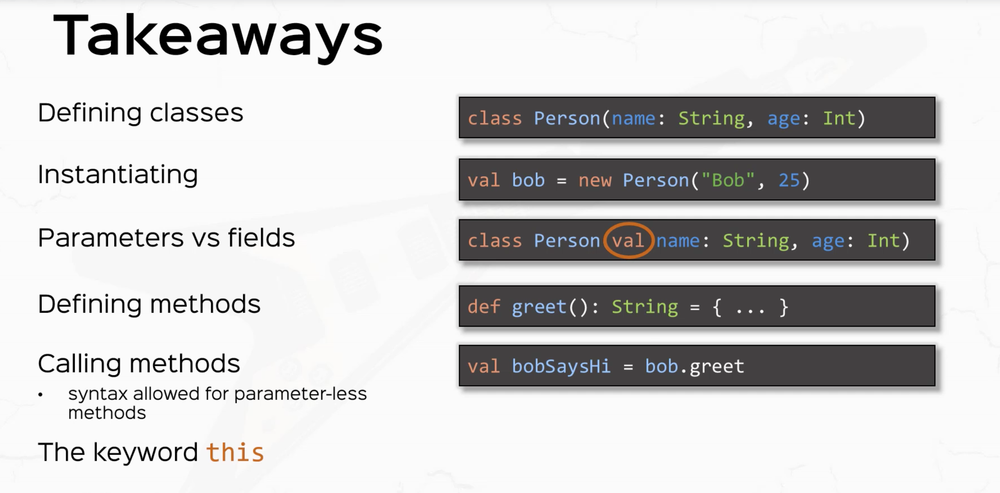
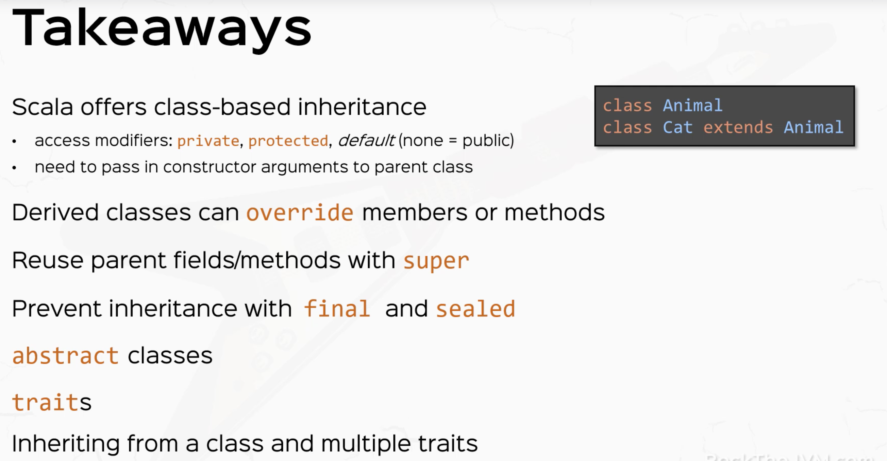
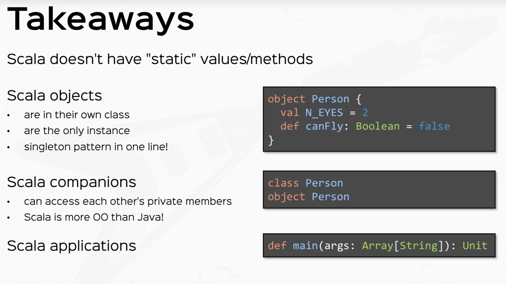
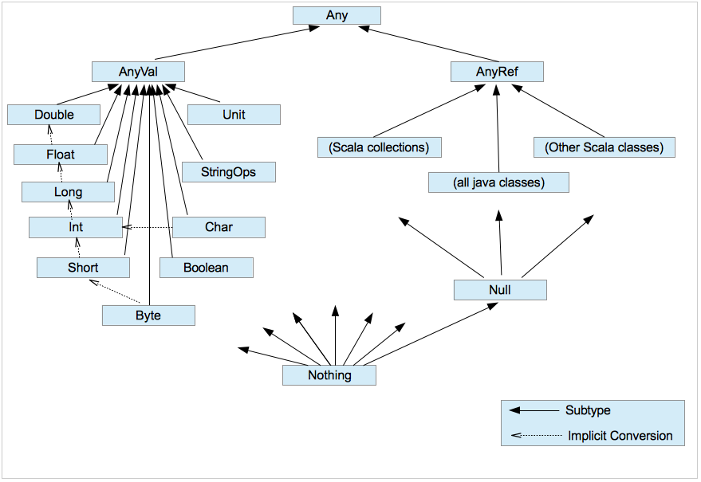

## Classes
_Classes_ in Scala are very similar to classes in Java.

They are templates containing fields and methods. Like in Java, classes can be instantiated using the new construct, there can be many “instances” (or “objects”) of the same class.

In Scala there exists a special kind of class named _case classes_. We'll take about those later.

Classes in Scala cannot have static members. You can use _Objects_ (see below) to achieve similar functionality as with static members in Java.



## Class methods
A _method_ is a function that is a member of some class, trait, or singleton object.  Scala has some interesting syntactic sugar to make calling methods more like natural language syntax.

* ```a b``` is equivalent to ```a.b```
* ```a b c``` is equivalent to ```a.b(c)```, _except_ when b ends in ```:``` In that case, ```a b c``` is equivalent to ```c.b(a)```
* Remember ```:``` at the end of a method name is for right associativity!
* ```a(b)``` is equivalent to ```a.apply(b)``` This is why the following definitions for an anonymous functions are identical:
```scala
val square1 = (x: Int) => x*x
val square2 = new Function1[Int,Int] {
    def apply(x: Int) = x*x
}
```
When calling ```square1(y)```, you are actually calling ```square1.apply(y)``` which ```square1``` must have as specified by the Function1 trait (or Function2, etc...)

* ```a(b) = c``` is equivalent to ```a.update(b,c)```. Likewise, ```a(b,c) = d``` is equivalent to ```a.update(b,c,d)``` and so on

* ```a.b = c``` is equivalent to ```a.b_=(c)```. When you create a ```val/var x``` in a Class/Object, Scala creates the methods ```x``` and ```x_=``` for you. You can define these yourself, but if you define ```y_=``` you must define ```y``` or it will not compile, for example:

```scala
scala> val b = new Object{ def set_=(a: Int) = println(a) }
b: java.lang.Object{def set_=(Int): Unit} = $anon$1@17e4cec

scala> b.set = 5
<console>:6: error: value set is not a member of java.lang.Object{def set_=(Int): Unit}
       b.set = 5
         ^

scala> val c = new Object{ def set = 0 ; def set_=(a:Int) = println(a) }
c: java.lang.Object{def set: Int; def set_=(Int): Unit} = $anon$1@95a253

scala> c.set = 5
5
```

* Infix Operators
You can write ```a identifier b``` where *identifier* denotes a method with two parameters
(one implicit, one explicit).  For example:

```scala
1 to 10
```

is actually a method call:
```scala
1.to(10)
```

This is called an *infix* expression because the operator is between the arguments.

* Unary Operators
```-a``` corresponds to ```a.unary_-```. Likewise for ```+a```,```~a```, and ```!a```

* Assignment Operators
```a <operator>= b``` is equivalent to ```a = a <operator> b``` e.g.

```scala
class test(val x:Int) {
    def %%(y: Int) = new test(x*y)
}

var a = new test(10)
a.x // 10
a %%= 5 // Equivalent to a = a %% 5
a.x // 50
```
Notes on Assignment Operators:

- <=, >=, and != are NOT assignment operators
- An operator starting with =, is never an assignment operator (==, ===. =/= etc.)
- If ```a``` has a method called ```operator=```, then that method is called directly


## Traits
Traits are like interfaces in Java, but they can also contain concrete members, i.e. method implementations or field definitions.

<!-- code -->
```scala
        trait Planar { ... }
        class Square extends Shape with Planar
```


## Objects
Object in Scala are like classes, but for every object definition there is only one single instance. It is not possible to create instances of objects using new, instead you can just access the members (methods or fields) of an object using its name.



## Class Definitions

<!-- code -->
```scala
    class MyClass(x: Int, y: Int) {           // Defines a new type MyClass with a constructor  
      require(y > 0, "y must be positive")    // precondition, triggering an IllegalArgumentException if not met  
      def this (x: Int) = { ... }             // auxiliary constructor   
      def nb1 = x                             // public method computed every time it is called  
      def nb2 = y  
      private def test(a: Int): Int = { ... } // private method  
      val nb3 = x + y                         // computed only once  
      override def toString =                 // overridden method  
          member1 + ", " + member2 
    }

    new MyClass(1, 2) // creates a new object of type
```

`this` references the current object, `assert(<condition>)` issues `AssertionError` if condition
is not met. See `scala.Predef` for `require`, `assume` and `assert`.

## Packages
Adding a statement such as package foo.bar at the top of a file makes the code in a file part of the package foo.bar. You can then do import foo.bar._ to make everything from package foo.bar available in your code. The content of a package can be scattered across many files. If you define a class MyClass in package foo.bar, you can import that specific class (and not anything else from that package) with import foo.bar.MyClass.

In Scala, everything can be imported, not only class names. So for instance if you have an object baz in package foo.bar, then import foo.bar.baz._ would import all the members of that object.

## Class hierarchies
<!-- code -->
```scala
    abstract class TopLevel {    // abstract class  
      def method1(x: Int): Int   // abstract method  
      def method2(x: Int): Int = { ... }  
    }

    class Level1 extends TopLevel {  
      def method1(x: Int): Int = { ... }  
      override def method2(x: Int): Int = { ...} // TopLevel's method2 needs to be explicitly overridden  
    }

    object MyObject extends TopLevel { ... } // defines a singleton object. No other instance can be created
```

## Class Organization

- Classes and objects are organized in packages (`package myPackage`).

- They can be referenced through import statements (`import myPackage.MyClass`, `import myPackage._`,
`import myPackage.{MyClass1, MyClass2}`, `import myPackage.{MyClass1 => A}`)

- They can also be directly referenced in the code with the fully qualified name (`new myPackage.MyClass1`)

- All members of packages `scala` and `java.lang` as well as all members of the object `scala.Predef` are automatically imported.

- General object hierarchy:

  - `scala.Any` base type of all types. Has methods `hashCode` and `toString` that can be overridden 
  - `scala.AnyVal` base type of all primitive types. (`scala.Double`, `scala.Float`, etc.)
  - `scala.AnyRef` base type of all reference types. (alias of `java.lang.Object`, supertype of `java.lang.String`, `scala.List`, any user-defined class)
  - `scala.Null` is a subtype of any `scala.AnyRef` (`null` is the only instance of type `Null`)
  - `scala.Nothing` is a subtype of any other type without any instance.
  




## Type Parameters

Conceptually similar to C++ templates or Java generics. These can apply to classes, traits or functions.

<!-- code -->
```scala
    class MyClass[T](arg1: T) { ... }  
    new MyClass[Int](1)  
    new MyClass(1)   // the type is being inferred, i.e. determined based on the value arguments  
```

It is possible to restrict the type being used, e.g.

<!-- code -->
```scala
    def myFct[T <: TopLevel](arg: T): T = { ... } // T must derive from TopLevel or be TopLevel
    def myFct[T >: Level1](arg: T): T = { ... }   // T must be a supertype of Level1
    def myFct[T >: Level1 <: Top Level](arg: T): T = { ... }
```
