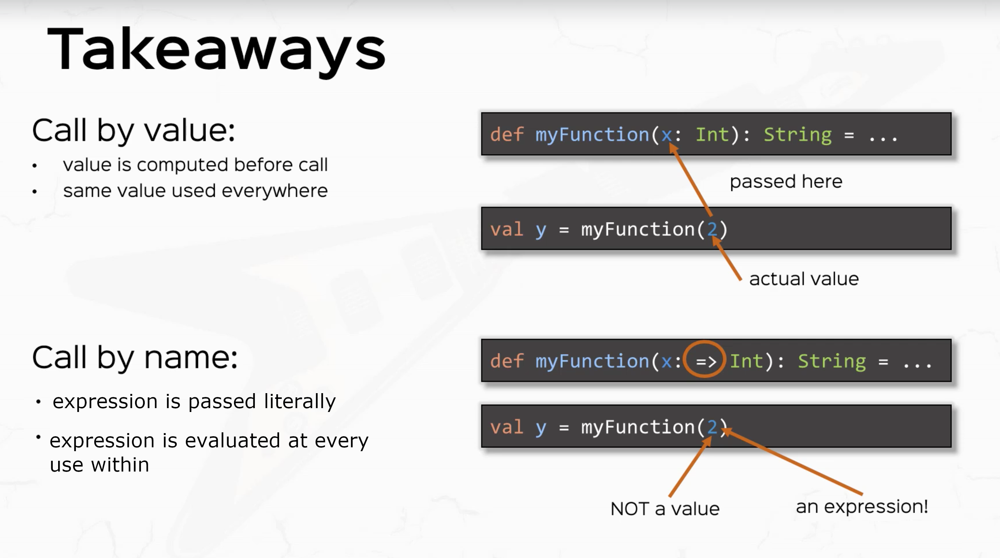

## Evaluation Rules for variables

<!-- code -->
```scala
    // expression is evaluated whenever example1 is called
    def example1 = {expression}      
    
    // expression is evaluated immediately when example2 is declared its value copied once
    val example2 = {expression}

    // expression is evaluated once, but not until example3 is used the first time     
    lazy val example3 = {expression} 
```


## Evaluation Rules for function arguments

- Call by value: evaluates the function arguments before calling the function
- Call by name: evaluates the function first, and then evaluates the arguments if need be
- Variable numbers of args are also possible

<!-- code -->
```scala
    // call by value.  In the function we replace x with the value of the expression passed after evaluation
    def square(x: Double)
 
    // call by name.  In the function we replace x with the expression itself that we passed in.
    def square(x: => Double)

   // bindings is a sequence of int, containing a varying # of arguments 
   def myFct(bindings: Int*) = { ... } 
```

 
