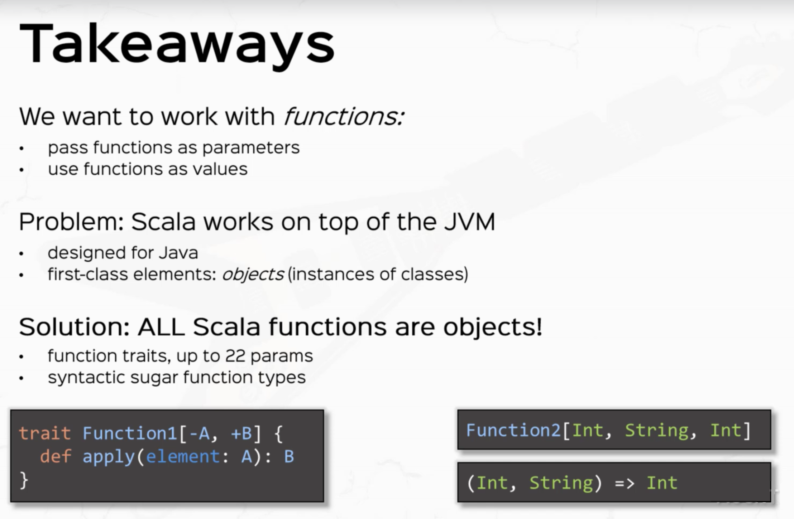

Higher order functions are functions that take a function as a parameter or return functions.

<!-- code -->
```scala
    // sum() returns a function that takes two integers and returns an integer  
    def sum(f: Int => Int): (Int, Int) => Int = {  
      def sumf(a: Int, b: Int): Int = { f(a) + f(b) }  
      sumf  
    } 

    // same as above. Its type is (Int => Int) => (Int, Int) => Int  
    def sum(f: Int => Int)(a: Int, b: Int): Int = { (f(a) + f(b) } 

    // Called like this
    sum((x: Int) => x * x * x)          // Anonymous function, i.e. does not have a name  
    sum(x => x * x * x)                 // Same anonymous function with type inferred

    def cube(x: Int) = x * x * x  
    sum(x => x * x * x)(1, 10) // sum of cubes 1 & 10
    sum(cube)(1, 10)           // same as above      
```


